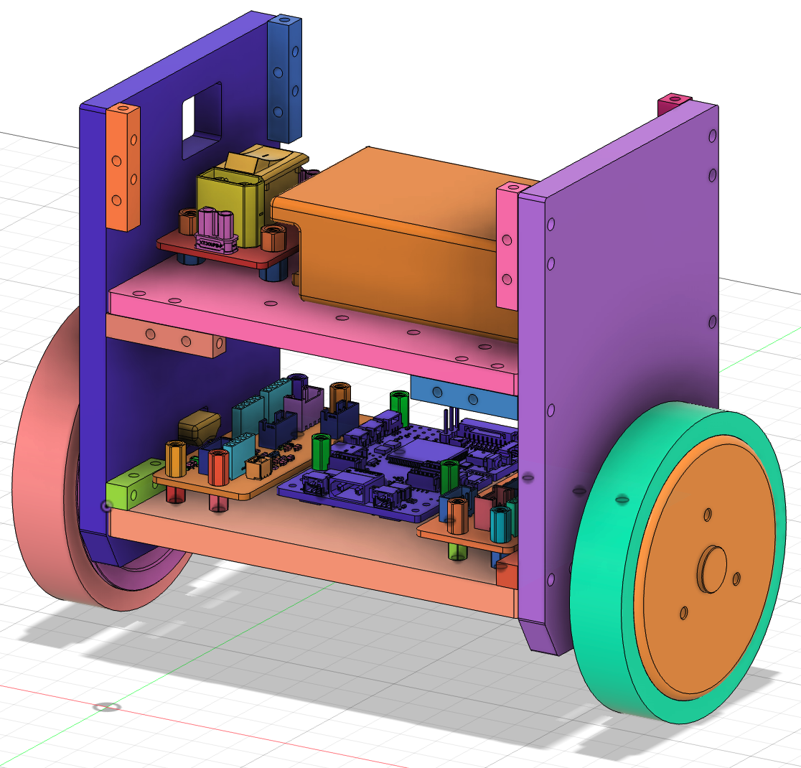

# Two-Wheeled Self-Balancing Robot

<figure><figcaption></figcaption></figure>

## Summary

This repository documents my work on a two-wheeled self-balancing robot built on an STM32H7-based control platform.

The project focuses on the core robotics stack needed to bring up a real robot system: embedded firmware, IMU integration, attitude estimation, motor communication, real-time balance control, system tuning, and hardware/software integration.

### What this project demonstrates

This project is intended to show that I have worked on a real robotic system beyond isolated coding tasks.

My contributions centered on:

* STM32 embedded firmware development
* IMU integration and attitude estimation
* motor driver communication and feedback parsing
* real-time balance control implementation
* system integration, debugging, tuning, and testing
* bringing the robot up as a working electromechanical system

### Project overview

The robot is a two-wheeled self-balancing platform that uses:

* an STM32H7 microcontroller as the main controller
* an IMU for body angle and angular rate feedback
* dual motor drivers for wheel actuation
* real-time control loops for balancing and motion regulation

The control stack includes:

* sensor acquisition
* attitude estimation
* motor communication
* balance control
* speed / turning control
* runtime debugging and parameter tuning

### My role

I want to be precise about scope.

This was not just a simulation or a small software-only class exercise. I worked on the embedded and robotics side end-to-end, including firmware, sensing, control, communication, integration, debugging, and physical system bring-up.

In particular, I worked on:

* embedded development on STM32
* IMU data handling and orientation estimation
* motor command / feedback communication
* balancing control implementation and tuning
* real-time debugging through serial tools / logging
* integration and testing on the actual robot platform

### Technical highlights

#### Embedded system

* STM32H7-based firmware
* HAL / CubeMX-based project structure
* FreeRTOS-based task organization in later versions
* UART / SPI / DMA usage for peripheral communication and debugging

#### Sensing and estimation

* IMU integration for body angle and angular velocity
* attitude estimation for balance control
* real-time sensor processing for control feedback

#### Motion control

* closed-loop balancing control
* speed and turning control structure
* parameter tuning for stable standing and recovery behavior
* practical debugging of oscillation, delay, and feedback issues

#### Motor communication

* communication with motor drivers over serial links
* frame parsing and feedback decoding
* handling command / response timing, errors, and robustness issues

### Repository structure

This repository contains multiple development versions from early bring-up to later integrated revisions.

Example folders include:

* `H7_0.x.x_*` — earlier STM32H7 development iterations
* `H7_1.x.x` / `H7_2.x.x` — later control and integration revisions
* `L475_M0603_Feedback` — related motor feedback experiments
* `CtrBoard-H7_ADC`, `H7_adc_uart`, `Button_LED`, `oled` — board/peripheral tests and supporting modules

In general:

* `Core/` contains application entry points and generated STM32 project files
* `Drivers/` contains STM32 HAL / CMSIS drivers
* `Middlewares/` contains middleware such as FreeRTOS
* `User/` and `User_Config/` contain user logic and project-specific modules
* `.ioc` files define STM32CubeMX configuration

Because this repository tracks many iterations, some folders are historical milestones rather than a single polished release branch.

### Key engineering challenges addressed

Some of the important engineering work in this project included:

* getting stable IMU-based attitude feedback on embedded hardware
* implementing balance control that worked on the real robot, not only in theory
* integrating sensing, control, and motor actuation into one real-time system
* debugging communication and timing issues between controller and motor drivers
* tuning the robot to achieve stable balancing behavior
* iterating through multiple firmware versions to improve reliability

### Demo / media

Add links here so recruiters can verify the robot quickly:

* Demo video: \[add link]
* Project page / website: [https://agile-navigator.gitbook.io/docs](https://agile-navigator.gitbook.io/docs)
* Photos: \[add link]

### If you are reviewing this for robotics experience

The best way to evaluate this repository is not as a single clean software package, but as an engineering record of building and iterating on a real robot.

The main evidence of robotics work here is:

* embedded firmware for a real controller
* sensor integration
* closed-loop control
* actuator communication
* system bring-up and debugging
* iteration across multiple hardware / firmware revisions

### Future cleanup

Planned improvements for this repository:

* add architecture diagrams
* add photos and videos of the robot
* document the most representative firmware version
* summarize hardware BOM and wiring
* provide a cleaner “start here” guide for reviewers

### Contact

If you are a recruiter or engineer reviewing this project and would like a short walkthrough of the architecture and my exact contributions, feel free to reach out.

**Author:** Yuyang Huang

